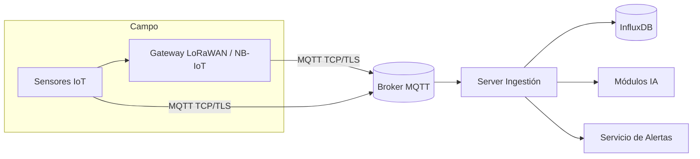

# Monitoreo de Incendios Forestales con IoT y IA

Este repositorio contiene un sistema completo para la prevención y control de incendios forestales basado en sensores IoT, comunicación MQTT, almacenamiento en InfluxDB y módulos de Inteligencia Artificial.

## 📦 Estructura de Archivos

* `sensor_node.py`      : Nodo sensor que simula y publica lecturas (temperatura, humedad, CO₂, humo) a un broker MQTT.
* `gateway.py`          : Gateway que simula recepción por LoRaWAN/NB-IoT y reenvía los datos al mismo topic MQTT.
* `server_ingest.py`    : Servicio backend que se suscribe al topic MQTT, almacena los datos en InfluxDB y verifica umbrales de alerta.
* `ai_module.py`        : Funciones para detección de humo (CNN) y predicción de propagación de incendios (LSTM).
* `alert_service.py`    : Envía notificaciones (SMS y correo) cuando se superan los umbrales definidos.
* `requirements.txt`    : Lista de dependencias Python.

## 🏗️ Arquitectura de Alto Nivel



## 🎯 Funcionalidad

1. **Sensor Node** lee parámetros ambientales y publica JSON a MQTT.
2. **Gateway** simula nodos LoRa, recibe paquetes y re-publica a MQTT.
3. **Server Ingest** guarda los datos en InfluxDB y evalúa umbrales.
4. **AI Module** detecta humo y estima propagación.
5. **Alert Service** notifica vía SMS y correo si se supera un umbral.

## ⚙️ Requisitos

* Python 3.8+
* Broker MQTT con TLS (por ejemplo HiveMQ Cloud)
* InfluxDB v1.8+ (local o en Docker)
* Credenciales de Twilio (SMS) y SendGrid (correo)

## 🚀 Instalación y Ejecución

1. Clona el repositorio:

   ```bash
   git clone https://github.com/tu-usuario/forest-fire-monitor.git
   cd forest-fire-monitor
   ```
2. Crea y activa un entorno virtual:

   ```bash
   python -m venv .venv
   source .venv/bin/activate     # Linux/macOS
   .\.venv\Scripts\activate    # Windows
   ```
3. Instala las dependencias:

   ```bash
   pip install -r requirements.txt
   ```
4. Configura las variables de entorno (puedes usar un archivo `.env`):

   ```env
   # MQTT
   HIVE_MQ_BROKER=ec6ee2c3428541a5b0c076d0aca0163e.s1.eu.hivemq.cloud
   HIVE_MQ_PORT=8883
   HIVE_MQ_USERNAME=tu_usuario_hivemq
   HIVE_MQ_PASSWORD=tu_password_hivemq

   # InfluxDB
   INFLUX_HOST=localhost
   INFLUX_PORT=8086
   INFLUX_DB=forest_monitor

   # Twilio
   TWILIO_SID=your_twilio_sid
   TWILIO_TOKEN=your_twilio_token
   TWILIO_FROM=+1234567890
   TWILIO_TO=+0987654321

   # SendGrid
   SENDGRID_API_KEY=your_sendgrid_api_key
   FROM_EMAIL=alertas@tuempresa.com
   TO_EMAIL=emergencias@tuempresa.com
   ```
5. Arranca InfluxDB (local o Docker):

   ```bash
   docker run -d --name influxdb -p 8086:8086 influxdb:1.8
   ```
6. Ejecuta los servicios en terminales separadas:

   * Nodo sensor:

     ```bash
     python sensor_node.py
     ```
   * Gateway:

     ```bash
     python gateway.py
     ```
   * Server Ingest:

     ```bash
     python server_ingest.py
     ```


